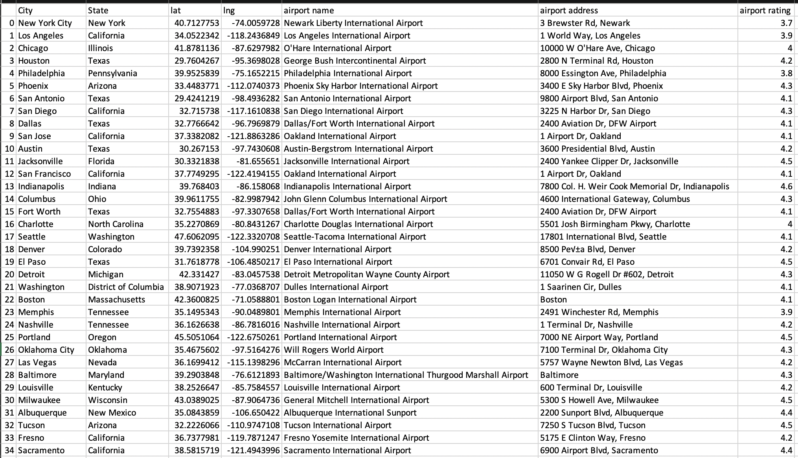

# Airport_Ratings_API
##### Goal: Utilizing Google Geocoding API, and Google Places API to create a DataFrame that include information for airports in each city. 

---

- Initially we start with a table that contains 100 city names, and their associated states. 

- We first use Google Geocoding API to process the coversion of addresses, such as New York City, New York, into geographic coordinations of latitude and longitude. Once request.get pulls data, we add it to new columns ["lat"] and ["lng"] in dataframe.

Reference: [Geocoding API](https://developers.google.com/maps/documentation/geocoding/overview)

First request.get complete, and add data to new columns:

Code:

	for index, row in df.iterrows():

	    # get city and state from row
	    city = row["City"]
	    state = row["State"]
	    target_city = f"({city}, {state})"
	
	    # add address and API key to params dict
	    params['address'] = target_city
	    params["key"] = gkey
	
	    # assemble url and make API request
	    print(f"Retrieving Results for Index {index}: {target_city}.")
	    response = requests.get(base_url, params=params).json()
	    
	    # extract results
	    lat = response["results"][0]["geometry"]["location"]["lat"]
	    lng = response["results"][0]["geometry"]["location"]["lng"]
	    
	    
	    try:
	        print(f"geocode for {target_city} is ({lat},{lng}.)")
	        
	        df.loc[index, 'lat'] = lat
	        df.loc[index, 'lng'] = lng
	
	        
	    except (KeyError, IndexError):
	        print("Missing field/result... skipping.")
	        
	    print("------------")
    	    
- Next, with the latitude and longitude of the location, we utilize Google Nearby Search API to search for nearest airport in the specified area. We collect name of airport and its rating, and add them to new columns ["airport name"], ["airport address"], and ["airport rating"]

Reference: [Nearby Search API](https://developers.google.com/maps/documentation/places/web-service/search-nearby)

Request.get complete, and add data to new columns. 

Code:
	

    for index, row in df.iterrows():
	
	    # get lat and lng from each row
	    lat = row["lat"]
	    lng = row["lng"]
	    location = f"{lat},{lng}"
	
	    # add keyword to params dict
	    params = {
	        "location": location,  # index location coords
	        #"rankby": "distance",
	        "radius": 50000,
	        "keyword": "international+airport",
	        "key": gkey,
	        "type": "airport",
	    }
	
	    # assemble url and make API request
	    print(f"Retrieving Results for Index {index}: {location}.")
	    response = requests.get(base_url, params=params).json()
	    
	    try:
	        # extract results
	        name = response["results"][0]["name"]
	        rating = response["results"][0]["rating"]
	        address = response["results"][0]["vicinity"]
	    
	    
	    
	        print(f"The nearest airport for this location ({location}) is {name}, and its rating is {rating}")
	        
	        df.loc[index, 'airport name'] = name
	        df.loc[index, 'airport rating'] = rating
	        df.loc[index, 'airport address'] = address
	
	        
	    except (KeyError, IndexError):
	        print("Missing field/result... skipping.")
	        
	    print("------------")	    
	    

Final Output: (Dataframe that includes new columns: lat, lng, airpot name, airport address, and airpot rating.)
